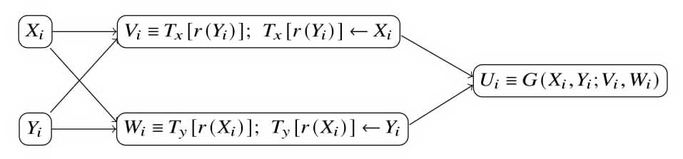

# SAFE and eSAFE Generators

## SAFE Generators

SAFE stands for **Secure And Fast Encryption**. The construction was proposed by Deng et al. [[1]](#references), and a more detailed treatment is provided in the RNG book [[2]](#references). SAFE is a combined random number generator designed to improve the security-oriented properties of classical generators while retaining their suitability for computer simulation. Classical generators such as multiple recursive generators (MRGs), PCG64, and MT19937 can provide strong theoretical or empirical performance for simulation, but they are not cryptographically secure random number generators by themselves.

The SAFE construction combines two baseline generators through a mutual-shuffling mechanism and a nonlinear output-mixing function. Instead of exposing the raw output of either generator directly, SAFE allows any two RNGs to be selected as the baseline generators and uses two shuffle tables and transformation functions to produce the final output sequence. 

<!-- Add SAFE construction diagram here. -->

Deng et al. [1] recommend using a DX generator and MT19937 as the baseline generators because both have long periods, high-dimensional equidistribution, efficiency, and portability, collectively known as the [HELP](index.md#dx-generators-a-class-of-efficient-mrgs) properties.

## General Construction

A SAFE generator uses two baseline generators, denoted by $X$ and $Y$.
At iteration $i$, the two baseline generators update their internal states
according to their own generating algorithms and produce the current values
$X_i$ and $Y_i$.

SAFE also maintains two shuffle tables of the same size:

$$
T_x = (T_{x,0}, T_{x,1}, \ldots, T_{x,2^C-1}), \qquad
T_y = (T_{y,0}, T_{y,1}, \ldots, T_{y,2^C-1}),
$$

where $2^C$ is the table size. The entry-index-selection function is

$$
r(z) = z\ \&\ (2^C - 1),
$$

where $\&$ denotes the bitwise AND operation. Since the table size is a power of two, this function extracts the lower $C$ bits of $z$ and maps the value to a valid table index.

## Mutual Shuffling

After $X_i$ and $Y_i$ are generated, SAFE extracts intermediate values from the shuffle tables and then updates the selected entries. The table extraction and update are defined as

$$
V_i = T_x[r(Y_i)], \qquad T_x[r(Y_i)] \leftarrow X_i,
$$

and

$$
W_i = T_y[r(X_i)], \qquad T_y[r(X_i)] \leftarrow Y_i.
$$

Thus, $X_i$ is used to update the table associated with $Y$, while $Y_i$ is used to update the table associated with $X$. This mutual-shuffling step mixes the two baseline streams and introduces additional intermediate states $V_i$ and $W_i$.

## Output Mixing

The final output is generated from the internal states $X_i, Y_i$ and the intermediate states $V_i, W_i$. In general, the output can be written as

$$
U_i = G(X_i, Y_i; V_i, W_i),
$$

where $G$ is a nonlinear mixing function.

A commonly used 32-bit mixing form is

$$
G_{b_x b_y b_v b_w}(x,y;v,w)
=
\left(
    b_x f_1(x)
    + b_y f_2(y)
    + b_v f_3(v)
    + b_w f_4(w)
\right) \bmod 2^{32},
$$

where $b_x, b_y, b_v, b_w \in \{0,1\}$. The functions $f_j$ are bit-rotation transformations defined by

$$
f_j(x) = (x \gg r_j) \oplus (x \ll (32-r_j)), \qquad j=1,2,3,4,
$$

where $r_j$ is the rotation size, $\gg$ denotes logical right shift, $\ll$ denotes logical left shift, and $\oplus$ denotes bitwise XOR. In a 32-bit implementation, the result is interpreted modulo $2^{32}$.

To balance the number of possible combinations and computational cost, the original SAFE construction recommends using three of the four available transformed values. For example,

$$
U_i = G(X_i, Y_i; V_i, W_i)
= \left(f_1(X_i) + f_2(Y_i) + f_4(W_i)\right) \bmod 2^{32}.
$$

## Generating Algorithm

For each iteration $i$, the SAFE output is generated as follows:

1. **Internal states:** Compute $X_i$ and $Y_i$ using the corresponding generating algorithms of the two baseline generators $X$ and $Y$.
2. **Intermediate states:** Apply mutual shuffling: 
   compute $V_i = T_x[r(Y_i)]$, then update $T_x[r(Y_i)] \leftarrow X_i$; 
   compute $W_i = T_y[r(X_i)]$, then update $T_y[r(X_i)] \leftarrow Y_i$.
3. **Output:** Return

$$
U_i = G(X_i, Y_i; V_i, W_i),
$$

where $G$ is one of the recommended output-mixing functions.

## Properties

SAFE is a combination-generator framework. Its behavior depends on the two baseline generators, the shuffle-table size, the table initialization, and the selected output-mixing function.

- **Flexible combination of baseline generators:** SAFE can combine any two random number generators as its baseline generators, allowing users to select different generator combinations according to their application requirements. For example, NextRNGBook currently provides a SAFE configuration that combines the DX generator and PCG64.
- **Mutual shuffling:** Each generator selects and updates entries containing values from the other generator. This breaks the linear structure of linear generators and reduces the direct correspondence between the baseline sequences and the final output sequence.
- **Nonlinear output transformation:** The final output is produced through bit rotations, modular addition, and bitwise operations rather than directly returning $X_i$ or $Y_i$.
- **Long period from component generators:** If the two baseline generators have periods $P_X$ and $P_Y$, the combined period can be as large as $\operatorname{lcm}(P_X, P_Y)$ under suitable conditions [[1, 4]](#references). When $P_X$ and $P_Y$ are relatively prime, this value is $P_XP_Y$.
- **Empirical quality:** The SAFE construction is designed to preserve good empirical behavior when the baseline generators and transformation parameters are chosen carefully.
- **Flexible construction for parallel workflows:** NextRNGBook provides 14,602 selectable DX generator configurations. Different DX configurations can be used to construct separate streams across parallel workers. The PCG64 component is initialized from the seed, which determines its initial state, LCG increment and multiplier.

Unlike a DX generator, SAFE is a combination-generator framework rather than a generator defined by a single recurrence. Its properties depend on both baseline generators and the additional shuffling and output-mixing configuration; moreover, the SAFE generator is designed with security in mind.

The main computational disadvantage is that SAFE advances two baseline generators and performs two table operations for each output value. Because each complete internal update produces only one output value, this computational cost cannot be spread across multiple outputs, and SAFE can therefore be slower than a conventional single-stream generator. This limitation motivates the multi-output eSAFE construction, which attempts to improve throughput while preserving the empirical quality of SAFE.

For further details, see the SAFE paper, *Secure and Fast Encryption (SAFE) with Classical Random Number Generators* [[1]](#references). The book [[2]](#references) discusses classical secure generators in Chapter 11, software and hardware secure generators in Chapter 12, methods for increasing security in Chapter 13, and SAFE generators in Chapter 14.

## eSAFE Generators

The character e stands for **efficiency**. As discussed above, SAFE advances two baseline generators and updates two shuffle tables during each internal update, but produces only one output value. This makes the computational cost per output relatively high and can limit generation speed. eSAFE was introduced to address this limitation as a multi-output extension of the SAFE construction.

Instead of producing only one value per internal update, an eSAFE generator generates a block of output values from the same set of current and intermediate values and stores them in an output buffer. Subsequent requests return values from this buffer without performing another complete SAFE update. Once the buffer is exhausted, the generator performs the next internal update and refills the buffer.

The standard SAFE algorithm produces one output value $U_i$ per iteration, whereas an eSAFE generator produces several output values from the same values $X_i$, $Y_i$, $V_i$, and $W_i$. This design reduces the average update cost per returned value. However, the block size must be selected carefully. Producing too many outputs from the same internal values can introduce stronger dependence among outputs and may reduce empirical test performance, depending on the baseline generators and mixing functions.

For example, a four-output eSAFE variant can be written as

$$
\begin{aligned}
U_{i,1} &= \left(f_1(X_i) + f_2(Y_i) + f_3(W_i)\right) \bmod 2^{32}, \\
U_{i,2} &= \left(f_4(X_i) + f_5(Y_i) + f_6(V_i)\right) \bmod 2^{32}, \\
U_{i,3} &= \left(f_7(X_i) + f_8(V_i) + f_9(W_i)\right) \bmod 2^{32}, \\
U_{i,4} &= \left(f_{10}(Y_i) + f_{11}(V_i) + f_{12}(W_i)\right) \bmod 2^{32}.
\end{aligned}
$$

Here, $f_j$ denotes a bit-rotation transformation with its own rotation size $r_j$. Once the four values are generated, they can be returned one by one. When the buffered outputs are exhausted, the generator performs the next SAFE/eSAFE update to produce a new block of output values.

## Statistical Properties

eSAFE retains the internal state-update, mutual-shuffling, and nonlinear
output-mixing mechanisms of the [SAFE generator](#safe-generators).
It therefore inherits the key mathematical and statistical properties of
the selected SAFE configuration, including period characteristics
determined by its two baseline generators and the ability to use
generators with long periods and strong equidistribution.

eSAFE produces multiple buffered outputs from each SAFE-style update, so
the buffer size represents a trade-off between speed and possible
dependence among nearby outputs. In the TestU01 Crush evaluation,
eSAFE-DX1-PCG64-M8 produced only small proportions of extreme p-values,
with results comparable to PCG32 and the evaluated DX generators.

## Speed Improvement over SAFE

SAFE performs one complete internal update for every output. eSAFE
generates and buffers multiple outputs per update. This reduces the
average computation cost per returned value while preserving the core
[SAFE construction](#safe-generators).

In the package benchmark, SAFE-DX-PCG64 achieved an overall relative
throughput of 68.9. eSAFE-DX-PCG64-M4 achieved 101.8, approximately 48%
faster than SAFE, and eSAFE-DX-PCG64-M8 achieved 113.6, approximately
65% faster than SAFE. For the complete benchmark and TestU01 results,
see [Evaluation of Random Number Generators](evaluation.md).

## Generator Notation

The generator configurations used in the empirical and performance evaluations are named according to their construction and baseline generators.

A SAFE generator is denoted by

$$
\text{SAFE-RNGX-RNGY},
$$

where $X$ and $Y$ identify the first and second baseline generators, respectively. For example, **SAFE-DX-PCG64** denotes a SAFE generator that uses a DX generator and PCG64 as its two baseline generators.

An eSAFE generator is denoted by

$$
\text{eSAFE-RNGX-RNGY}\text{-M}m,
$$

where $X$ and $Y$ are the two baseline generators and $m$ is the output-buffer size. The suffix **M $m$** indicates that each internal eSAFE update produces $m$ output values, which are stored in a buffer and returned one by one. For example:

* **eSAFE-DX1-PCG64-M4** uses a type-$1$ DX generator and PCG64 as its baseline generators and produces four buffered outputs per internal update.
* **eSAFE-DX1-PCG64-M8** uses the same baseline-generator combination but produces eight buffered outputs per internal update.

For empirical TestU01 results and performance comparisons, see
[Evaluation of Random Number Generators](evaluation.md)

## references

[1] Deng, L. Y., Shiau, J. J. H., Lu, H. H. S., & Bowman, D. (2018). 
*Secure and fast encryption (SAFE) with classical random number generators.* ACM Transactions on Mathematical Software (TOMS), 44(4), 1-17.

[2] Deng, L.-Y., Kumar, N., Lu, H. H.-S., & Yang, C.-C. (2025). 
*Random Number Generators for Computer Simulation and Cyber Security:
Design, Search, Theory, and Application* (1st ed.). Springer. 
[https://doi.org/10.1007/978-3-031-76722-7](https://doi.org/10.1007/978-3-031-76722-7)

[3] https://numpy.org/doc/stable/reference/random/performance.html

[4] Li, C. Y., Chen, Y. H., Chang, T. Y., Deng, L. Y., & To, K. (2011). 
Period extension and randomness enhancement using high-throughput reseeding-mixing PRNG. IEEE Transactions on Very Large Scale Integration (VLSI) Systems, 20(2), 385-389.